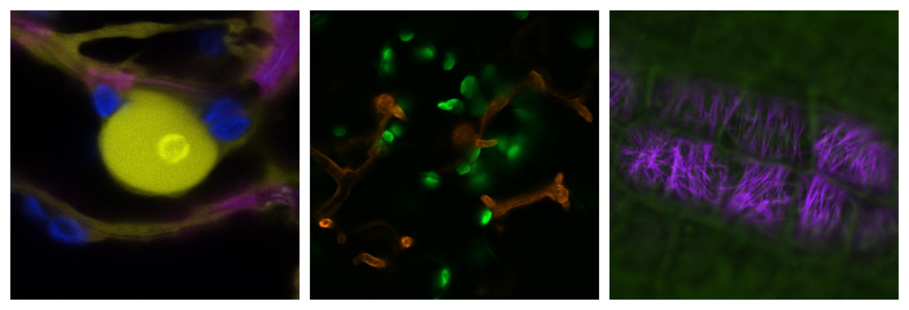

# HFinder

HFinder is a modular and semi-automated pipeline for the detection and segmentation of filamentous microbes (such as fungi or oomycetes) and their specialized infection structures (e.g., haustoria) in confocal microscopy images. Designed for flexibility and extensibility, it supports both automated detection using [YOLOv8](https://yolov8.com/) and manual correction workflows when needed.

The pipeline handles:

- Image preprocessing and composite generation from multi-channel TIFF files.
- Binary mask creation and contour extraction for filamentous structures.
- Conversion to YOLO-compatible annotation formats for training object detection models.
- Training and evaluation of segmentation models via Ultralytics YOLOv8.
- Integration of external annotations (e.g., from [Makesense AI](https://www.makesense.ai/)) with rescaling support.

HFinder is intended for researchers studying plant–microbe interactions and host colonization dynamics, providing tools to accelerate the annotation and analysis of large image datasets.

## Key Features
- **Multi-channel TIFF support**: Automatically extracts, thresholds, or segments specific channels within multi-frame TIFFs. Each channel or z-slice can be treated independently or combined based on user-defined instructions.
- **Flexible annotation workflow**: Supports both automatic segmentation (via thresholding) and custom annotations (via JSON polygons), enabling hybrid workflows.
- **YOLOv8-compatible dataset generation**: Converts raw TIFF data into structured datasets (images, masks, metadata) for direct use in YOLOv8 training pipelines, including automatic generation of dataset.yaml.
- **Class-aware image mapping**: Supports class-specific instructions, allowing different segmentation strategies per class or per image.


## Installation

### Dependencies
To run HFinder, you need to install the following dependencies:
- The YAML library [pyyaml](https://pypi.org/project/PyYAML/)
- The Python YOLO interface [ultralytics](https://docs.ultralytics.com/fr/quickstart/)
- The TIFF library [tifffile](https://pypi.org/project/tifffile/) 

You can do so by running:
```
pip install pyyaml ultralytics tifffile
```
It is recommended to use a virtual environment.

### Running
You can then run HFinder as follows:

```
$ python hfinder.py <action>
```

where action can be `check`, `train`, or `predict`.

## Creating a training dataset 

<p align=center>

</p>

HFinder allows you to prepare YOLO-compatible datasets from microscopy images 
in TIFF format. It supports both single-frame images and multi-frame stacks 
(Z-stacks or time series), providing flexibility for various acquisition protocols.

### Step 1 — Choose Your TIFF Images
Prepare your microscopy data as .tiff files. These can be:
- Single images: 1 frame × N channels.
- Z-stacks or time series: M frames × N channels.

All channels must be arranged consistently, and the file should reside in the 
appropriate folder (defaults to `data`, but you can change it with `--tiff_dir`).

### Step 2 — Define Your Classes
Classes are declared using a JSON file placed in the `classes` directory. Each 
entry corresponds to a biological structure you want to detect. For each class, 
specify:

- Which channel to use.
- The method to generate masks (see below).

Example snippet from a class definition file `membrane.json`:

```
{
  "image-1.tiff": { "channel": 2, "threshold": 0.85 },
  "image-2.tiff": { "channel": 1, "segment": "image-2_membrane.json" }
  "image-3.tiff": 3
}
```

### Step 3 — Choose How Masks Are Created
There are three supported methods to define masks:

- **Automatic thresholding**: If no threshold or segmentation is specified, 
HFinder uses one of OpenCV’s automatic methods (e.g., Otsu or Triangle) to 
create a binary mask from the channel signal.

- **User-defined threshold**: You can set an explicit threshold value (as 
percentile or raw intensity). For example, `"threshold": 0.85` uses the 85th 
percentile of the signal as cutoff.

- **Manual annotation**: You may provide polygon annotations via a JSON file. 
This is useful if you've already segmented or manually labeled your structures 
of interest.

### Step 4 — Launch Dataset Generation
Once the input TIFF and class file are ready, run the script to generate a training dataset. The script will:

1. Extract the requested channels.
2. Apply the chosen segmentation methods.
3. Colorize and combine selected channels into RGB images.
4. Use unannotated channels as structured noise, increasing the robustness of the model.
5. Save .jpg images and corresponding YOLO-format label files into the appropriate `dataset/images/train` and `dataset/labels/train` folders.

The final dataset includes color-mixed images and polygon-based segmentations, 
ready for training a YOLO model on microscopy data.

## Prediction mode

(...)
