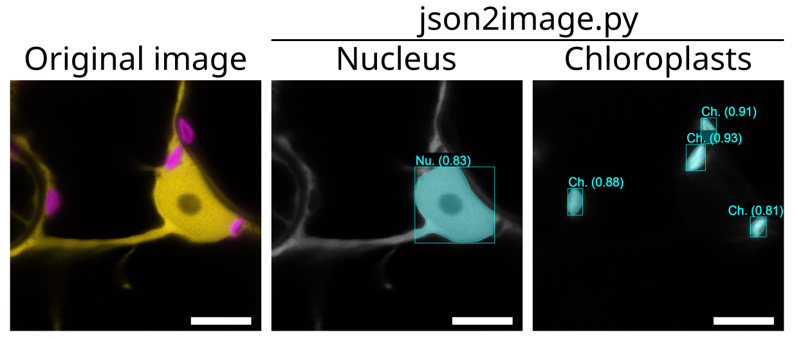

# HFinder Toolbox

HFinder is distributed with auxiliary scripts that enable visualisation of results, and various quantitative analyses.

## Visualizing Predictions

Once predictions have been consolidated into COCO-style JSON files, they can be 
easily visualized with the `json2images.py` utility. This script loads the JSON 
annotations and the corresponding TIFF channels, then generates PNG images that 
overlay the predicted objects.

Key features:
- **Channel-aware visualization**: Each annotation is shown on the specific 
  channel where it was detected.
- **Bounding boxes & polygons**: Both are drawn in overlay, with optional 
  semi-transparency for polygons to reveal underlying structures.
- **Confidence display**: Prediction confidences are displayed alongside class 
  names; optionally, bounding boxes can be color-coded using a confidence-based 
  palette (e.g., *viridis*).
- **Category-wise output**: One PNG per predicted category is generated, 
  facilitating inspection of individual structures.

This visualization step is particularly useful for quality control, 
publication-ready figures, and quickly identifying whether predicted channels 
match expected biological structures.

|Command|Description|Default value|
|-|-|-|
|`-d <path>` or `--tiff_dir <path>`|Folder containing TIFF files|Current directory|
|`-c <path>` or `--coco_dir <path>`|Folder containing COCO JSON files|Current directory|
|`-o <path>` or `--out_dir <path>`|Output directory for PNG files|Current directory|
|`-lab` or `--no_labels`|Do not display labels and confidence values|Inactive|
|`-box` or `--no_bounding_boxes`|Do not display bounding boxes around polygons|Inactive|
|`-p <name>` or `--palette <name>`|Matplotlib colormap used to encode confidence values|#00FFFF|

## Measuring Distances

...

## Signal Enrichment

...
