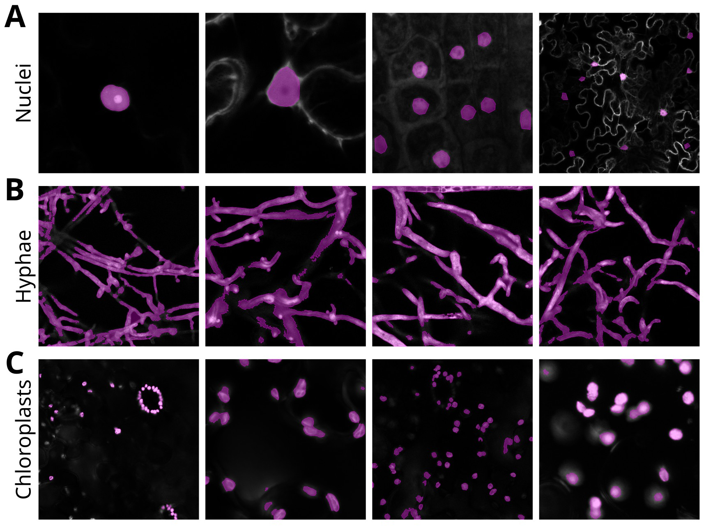

# Generating YOLO-Compatible Training Data with HFinder

## Introduction

Creating accurate and consistent training datasets is a critical step in 
developing effective object detection models. While it is possible to ask human 
annotators to manually draw polygons around every object of interest, this 
approach quickly becomes impractical for large image collections or 
high-resolution data. 

Manual annotation is not only slow and resource-intensive, but also subject to 
variability between annotators, leading to inconsistencies that can reduce model
performance. By generating polygons automatically, we can dramatically 
accelerate dataset creation while ensuring that all annotations follow the 
same geometric rules and accuracy standards. This approach also makes it 
possible to scale to thousands of training images without an exponential 
increase in effort.

HFinder is designed to automate polygon generation. It ingests high-resolution 
TIFFs (single frames or Z-stacks), separates and resizes their channels, then 
follows per-class instructions (fixed/auto thresholds or supplied polygons) to 
derive masks and convert them into YOLO-compatible polygons. To “explode” one 
TIFF into multiple training examples, HFinder enumerates combinations of the 
channels that carry annotations and overlays them—optionally adding 
non-annotated channels from the same Z-slice as structured noise (using distinct 
hues for each channel). The result is a set of color-fused JPEGs per TIFF, each 
paired with polygon labels in YOLO format; for stacks, HFinder can also export 
Maximum Intensity Projection (MIP)-based variants. These image/label pairs are 
written into the standard YOLO directory layout and used directly to train YOLO, 
yielding a detector that learns from consistent, reproducible annotations while 
avoiding the cost and variability of manual polygon drawing.

Once the dataset has been generated in this way, it can be used directly to 
train a YOLO model. YOLO (You Only Look Once) is a state-of-the-art real-time 
object detection framework that learns to detect and classify objects in a 
single pass through the image. The automatically generated JPEG-and-polygon 
pairs from HFinder become the model’s training samples, allowing YOLO to learn 
both the visual appearance and the shape boundaries of the target objects. This 
integration between automated annotation and model training enables rapid 
dataset generation, minimizes human intervention, and lays the groundwork for 
producing high-performance object detectors with consistent, reproducible 
annotations.

---

HFinder streamlines the preparation of YOLO-compatible datasets from microscopy 
images in **TIFF** format. It supports both **single-frame images** and 
**multi-frame stacks** (Z-stacks or time series), ensuring compatibility with a 
wide range of acquisition protocols. The tool can automatically create 
segmentation masks from raw channels, convert them into polygons, and export 
both images and annotations ready for YOLO training.

## Step 1 — Prepare Your TIFF Images

Your microscopy data should be saved as `.tiff` files. These can be:

- **Single images**: 1 frame × N channels.
- **Z-stacks or time series**: M frames × N channels.

Ensure that:

- Channels are arranged consistently across all files.
- TIFFs are stored in the designated folder (defaults to `data`, but you can 
change it via `--tiff_dir`).
- The naming convention allows easy matching with class definitions later.

---

## Step 2 — Define Your Classes

Classes are declared in **JSON files** placed inside the `classes` directory 
(a subdirectory of the folder containing TIFFs, e.g., `data`).
Each entry corresponds to a biological structure or object you want the model 
to detect. For each image-class pair, specify:

- **Which channel to use**.
- **How to generate masks** for that channel.

Example `membrane.json`:

```json
{
  "image-1.tiff": { "channel": 2, "threshold": 0.85 },
  "image-2.tiff": { "channel": 1, "segment": "image-2_membrane.json" },
  "image-3.tiff": { "channel": 3, "threshold": "li" },
  "image-4.tiff": 3
}
```

---

### **Step 3 — Choose How Masks Are Created**

HFinder supports **three main methods** for generating binary masks:

1. **Automatic thresholding**
   - If no explicit threshold, thresholding function, or segmentation file is 
   provided, HFinder automatically applies an OpenCV method (e.g., **Otsu** or 
   **Triangle**) to the selected channel.
   - This mode is ideal for quick segmentation when no prior information is available.

2. **User-defined threshold**
   - Specify a custom threshold in one of the following ways:
     - **Numeric value** — as a **percentile** (0–1) or a **raw intensity value**.
     - **Function name** — choose a thresholding algorithm such as `"isodata"`, `"otsu"`, `"li"`, etc. (case-insensitive).
   - **Example (percentile threshold):**
     ```json
     "threshold": 0.85
     ```
     Uses the **85th percentile** as the cutoff.

3. **Manual annotation**  
   - Provide polygon annotations in a `.json` file.
   - This option is useful when high-quality segmentations already exist, or when precise boundaries are drawn manually.
    - We recommend [Makesense.ai](https://www.makesense.ai/) for manual drawing.


In the end, your training dataset should consist exclusively of high-quality 
segmentations for all classes, ensuring that the model can learn effectively. 
Below is an example dataset with three annotated classes: nuclei, hyphae, and 
chloroplasts. The images show overlays of the raw channel data with segmentation
polygons (magenta) generated by one of the three methods described above. For 
instance, most nuclei are manually annotated (stored in `.json` files), since 
their often occur together with surrounding signals from cytoplasmic strands or 
the plasma membrane. In contrast, chloroplasts and hyphae are more reliably 
segmented using various thresholding approaches. Moreover, in most cases, 
manually segmenting these structures would be far too time-consuming.

<p align=center>

</p>

---

### **Step 4 — Generate the Dataset**

Once your **TIFFs** and **class definitions** are ready, run the HFinder script.
The process will:

1. **Extract** the relevant channels for each class.
2. **Apply** the chosen segmentation method (automatic, threshold-based, or manual polygons).
3. **Colorize** and **merge** channels into RGB images for YOLO training.
4. **Introduce structured noise** from unused channels to improve model robustness.
5. **Convert** masks to polygons and save them in **YOLO format**.
6. **Save** `.jpg` images and their corresponding label files in:

---

### **Step 5 — Result**

The final dataset contains:

- **Color-mixed JPEG images** derived from the original microscopy channels.
- **Polygon-based YOLO label files** describing the detected objects.

These outputs are **immediately ready** for training YOLO models on microscopy 
data, enabling **high-quality detection** without the burden of manual polygon 
drawing.

<p align=center>

</p>


